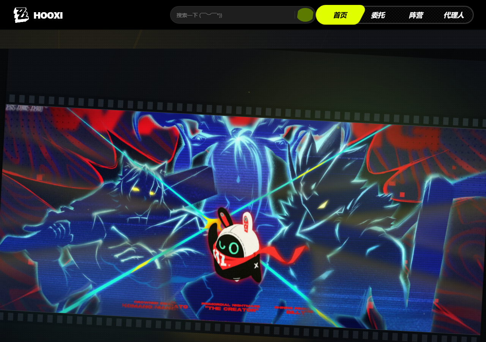
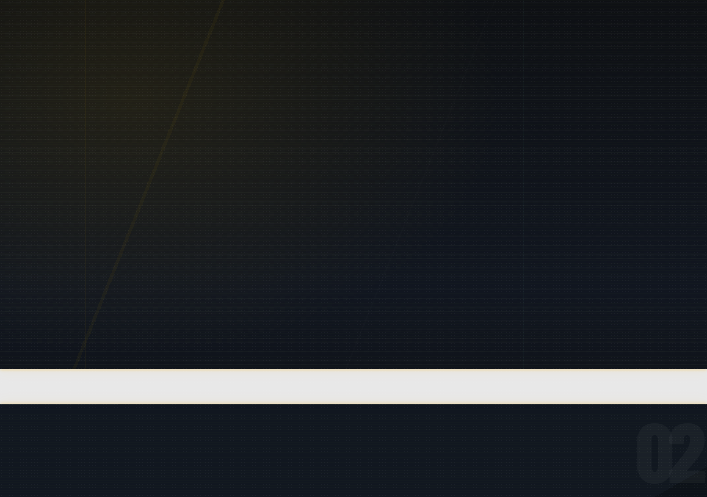
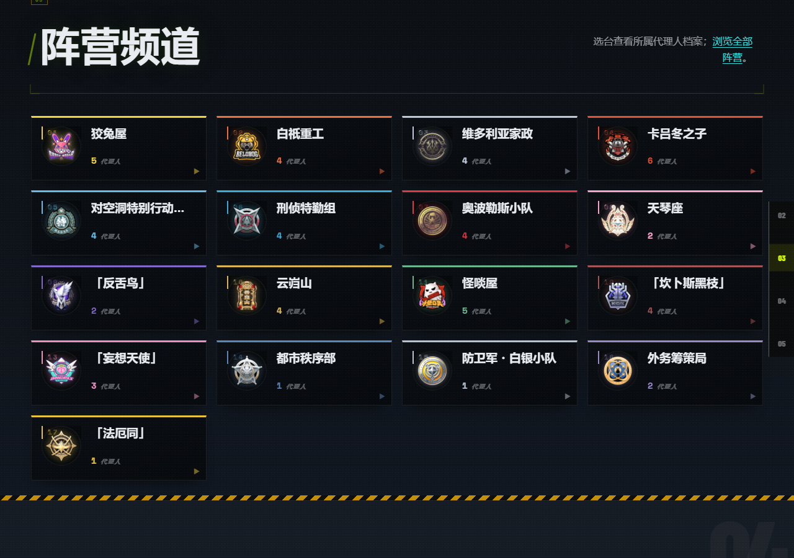
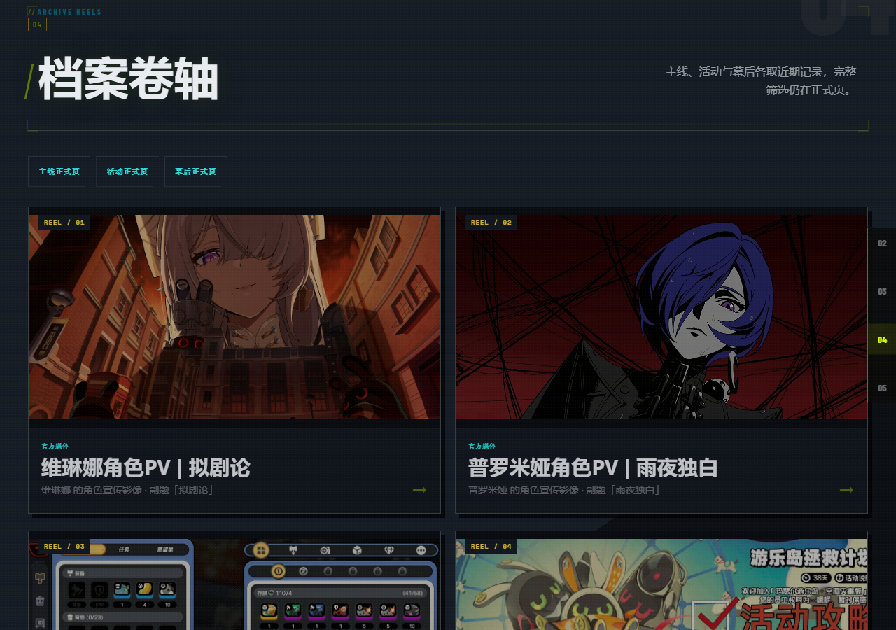
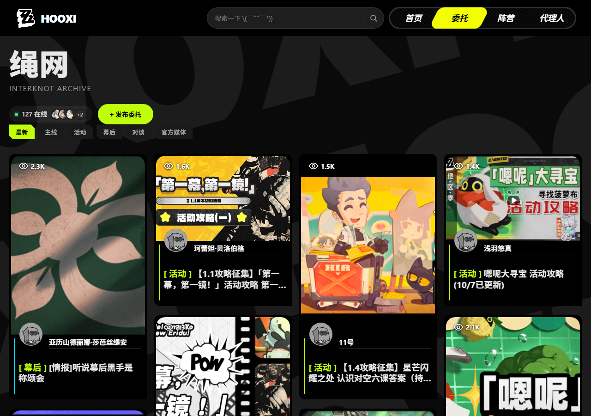
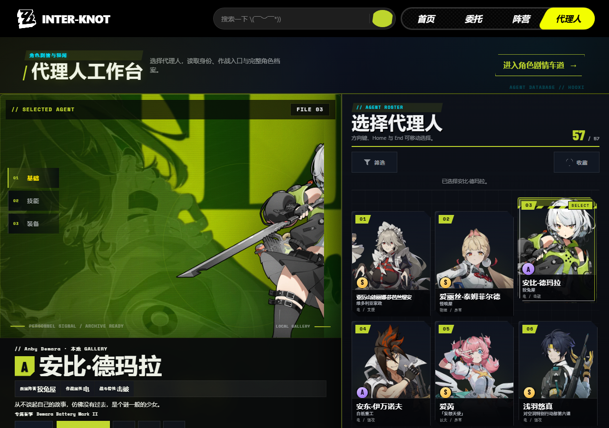

# HOOXI · 绝区零剧情档案站

> 一个按版本梳理《绝区零》剧情视频的同人档案站。黑金工业风，支持分类筛选和关键词搜索。

**在线访问** → [pokkan39.github.io/hooxi-zzz](https://pokkan39.github.io/hooxi-zzz/)



---

## 这是什么

HOOXI 是一个《绝区零》主题的剧情索引站，帮助玩家按版本、阵营、角色快速定位想看的剧情视频。

整站视觉大量参考游戏内"录像店"美学——扫描线、故障字效、镭射光泽、工业警示条纹，力求让网页本身也像一件游戏周边。

---

## 页面一览

### 首页

快速查档入口 + 阵营频道导航 + 最新档案卷轴。

| 快速查档 | 阵营频道 |
|---|---|
|  |  |

| 档案卷轴 | 关于站点 |
|---|---|
|  |  |

### 绳网（委托页）

按主线 / 活动 / 幕后 / 对谈分类，卡片双层黑底结构，悬停变 BFFF09 荧光绿，配代理人头像。



### 代理人档案

满屏双层影画首屏，档案内容区带英文名斜向跑马灯背景纹理，按阵营归类展示。



---

## 技术栈（大白话版）

| 用了什么 | 具体干什么 |
|---|---|
| HTML / CSS / JS | 首页、阵营页、代理人页——直接双击就能在浏览器打开 |
| React + Vite | 绳网（委托）页面，构建后输出静态文件 |
| GSAP | 卡片进场动画、光效等 |
| GitHub Pages | 免费托管，推送代码自动更新线上网站 |
| GitHub Actions | 每次推 main 分支自动构建打包，并发布到 Releases |

没有后端，没有数据库，全是静态文件——部署成本为零。

---

## 本地跑起来

**前置需要**：[Node.js](https://nodejs.org/)（v18 以上）和 [Git](https://git-scm.com/)

```bash
# 1. 克隆仓库
git clone https://github.com/Pokkan39/hooxi-zzz.git
cd hooxi-zzz

# 2. 安装依赖
npm install

# 3. 启动开发服务器（绳网 / 委托页）
npm run dev
# 浏览器打开 http://localhost:3000/events.html

# 4. 其他页面（首页、阵营、代理人）
# 直接双击 index.html / faction.html / stories.html 即可预览
```

---

## 部署

推送到 `main` 分支后，GitHub Actions 会自动构建并发布到 GitHub Pages，不需要手动操作。

也可以去 [Releases](https://github.com/Pokkan39/hooxi-zzz/releases) 下载打好包的静态文件，解压后扔到任意 Web 服务器直接用。

---

## 文件结构

```
hooxi-zzz/
├── index.html            # 首页
├── events.html           # 绳网（委托）入口
├── faction.html          # 阵营页
├── stories.html          # 代理人页
├── src/                  # React 组件源码（绳网页专用）
│   ├── pages/
│   ├── components/
│   └── styles/
├── assets/               # 图片、立绘、图标
├── docs/                 # 项目文档与截图
└── .github/workflows/    # 自动构建 & 发布配置
```

---

> 同人非商业创作，与米哈游官方无关。
